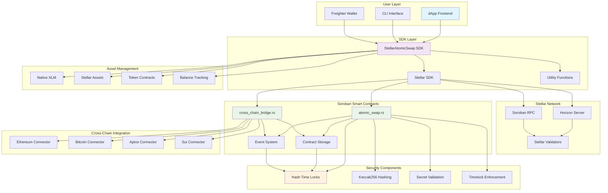
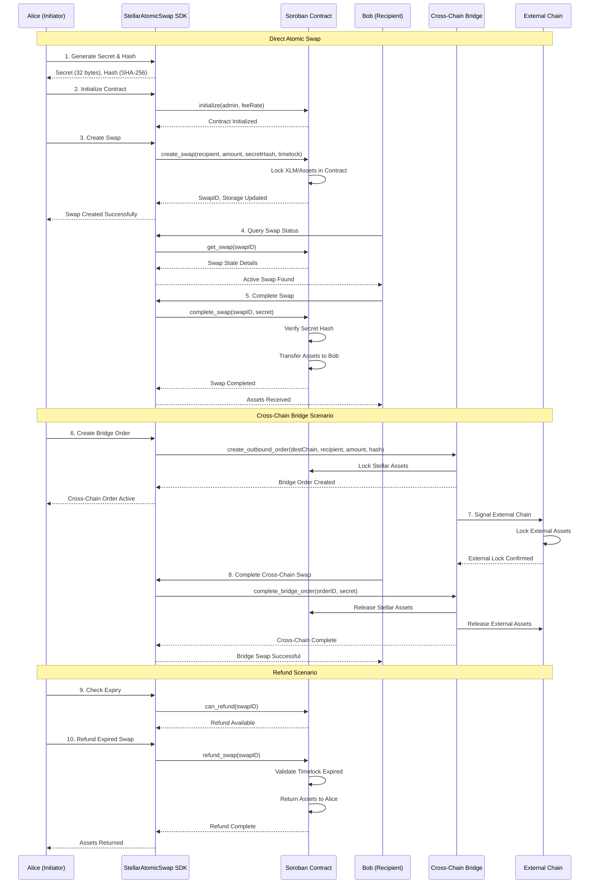

# 1inch Fusion+ Stellar Integration

Production-ready atomic swap implementation for Stellar blockchain using Soroban smart contracts, enabling secure cross-chain swaps through Hash Time-Locked Contracts (HTLCs).

## 🚀 Features

- ✅ **Atomic Swaps**: Secure, trustless swaps using HTLCs on Stellar
- ✅ **Soroban Smart Contracts**: Native Stellar smart contracts with optimal gas efficiency
- ✅ **Cross-Chain Bridge**: Coordinate swaps between Stellar and 10+ other blockchains
- ✅ **TypeScript SDK**: Type-safe, easy-to-use developer interface
- ✅ **Production Contracts**: Gas-optimized Rust contracts with comprehensive security
- ✅ **Testing Suite**: Unit and integration tests with high coverage
- ✅ **Demo Examples**: Working examples for quick onboarding

## 📁 Project Structure

```
stellar-integration/
├── src/                         # Soroban smart contracts (Rust)
│   ├── atomic_swap.rs          # Core HTLC implementation
│   ├── cross_chain_bridge.rs   # Cross-chain coordination
│   ├── types.rs                # Data structures and constants
│   ├── utils.rs                # Utility functions
│   └── lib.rs                  # Library entry point
├── sdk/                        # TypeScript SDK
│   ├── src/                    # SDK source code
│   │   ├── StellarAtomicSwap.ts # Main SDK class
│   │   ├── examples/           # Demo implementations
│   │   └── tests/              # Test suite
│   └── package.json           # SDK dependencies
├── Cargo.toml                  # Rust project configuration
├── package.json               # Node.js dependencies
└── README.md                  # This file
```

## 🏗️ Architecture

### System Architecture



### User Flow Diagram



## 🔧 Quick Start

### Installation

```bash
# Clone and navigate to project
cd stellar-integration

# Install Node.js dependencies
npm install

# Install Rust dependencies
cargo check

# Build TypeScript SDK
npm run build

# Compile Soroban contracts
npm run build:contracts
```

### Basic Usage

```typescript
import { StellarAtomicSwap, STELLAR_NETWORKS, Utils } from '@1inch/fusion-plus-stellar';

// Initialize SDK
const swapSDK = new StellarAtomicSwap({
    network: STELLAR_NETWORKS.testnet,
    contractAddress: 'CCONTRACT_ADDRESS_HERE',
    keypair: yourKeypair,
});

// Create test accounts (testnet only)
const alice = await StellarAtomicSwap.createTestAccount('testnet');
const bob = await StellarAtomicSwap.createTestAccount('testnet');

// Generate atomic swap secret
const secret = StellarAtomicSwap.generateSecret();
const secretHash = StellarAtomicSwap.generateHashlock(secret);

// Create atomic swap
const swapResult = await swapSDK.createSwap({
    recipient: bob.publicKey,
    amount: '1000000', // 0.1 XLM (in stroops)
    secretHash,
    timelock: StellarAtomicSwap.calculateTimelock(3600), // 1 hour
});

// Complete swap (Bob reveals secret to claim)
const completeResult = await swapSDK.completeSwap({
    swapId: swapResult.swapId,
    secret,
});
```

### Cross-Chain Bridge

```typescript
// Create outbound bridge order (Stellar → Ethereum)
const bridgeResult = await swapSDK.createBridgeOrder({
    destinationChainId: 2, // Ethereum
    recipient: 'ethereum_address_here',
    amount: '10000000', // 1 XLM
    secretHash,
    timelock: StellarAtomicSwap.calculateTimelock(7200), // 2 hours
});
```

## 🧪 Testing

```bash
# Run all tests
npm test

# Run Soroban contract tests
npm run test:contracts

# Run with coverage
npm test -- --coverage

# Run integration tests (requires network)
npm run test:integration
```

## 🚀 Deployment

### Development (Testnet)

```bash
# Deploy to Stellar testnet
npm run deploy:testnet
```

### Production (Mainnet)

```bash
# Deploy to Stellar mainnet
npm run deploy:mainnet
```

## 📖 API Reference

### StellarAtomicSwap Class

#### Constructor

```typescript
new StellarAtomicSwap(config: StellarAtomicSwapConfig)
```

#### Core Methods

| Method | Description | Returns |
|--------|-------------|---------|
| `generateSecret()` | Generate random secret for swap | `string` |
| `generateHashlock(secret)` | Create hash of secret | `string` |
| `createSwap(params)` | Create new atomic swap | `Promise<SwapResult>` |
| `completeSwap(params)` | Complete swap with secret | `Promise<CompleteResult>` |
| `refundSwap(swapId)` | Refund expired swap | `Promise<RefundResult>` |
| `getSwap(swapId)` | Get swap details | `Promise<SwapState>` |

#### Bridge Methods

| Method | Description | Returns |
|--------|-------------|---------|
| `createBridgeOrder(params)` | Create Stellar → Other chain order | `Promise<BridgeResult>` |
| `completeBridgeOrder(...)` | Complete bridge order | `Promise<CompleteResult>` |
| `getBridgeOrder(orderId)` | Get bridge order details | `Promise<BridgeOrder>` |

#### Utility Methods

| Method | Description | Returns |
|--------|-------------|---------|
| `getBalance(asset?)` | Get account balance | `Promise<string>` |
| `createTestAccount()` | Create funded test account | `Promise<Account>` |
| `verifySecret(secret, hash)` | Verify secret against hash | `boolean` |

## 🔒 Security Features

### Smart Contract Security

- **Reentrancy Protection**: Guards against reentrancy attacks
- **Timelock Validation**: Enforces minimum/maximum timelock durations
- **Hash Verification**: Cryptographic secret validation using Keccak256
- **Authorization Checks**: Proper access control for all operations
- **Event Emission**: Comprehensive event logging for transparency

### SDK Security

- **Input Validation**: Comprehensive parameter validation
- **Type Safety**: Full TypeScript coverage prevents runtime errors
- **Network Validation**: Stellar network configuration validation
- **Error Handling**: Graceful error handling and recovery
- **Private Key Management**: Secure key handling with Stellar SDK

## 🌐 Supported Chains

| Chain | Chain ID | Status |
|-------|----------|--------|
| Stellar | 1 | ✅ Native |
| Ethereum | 2 | ✅ Active |
| Bitcoin | 3 | ✅ Active |
| Aptos | 4 | ✅ Active |
| Sui | 5 | ✅ Active |
| Polygon | 6 | ✅ Active |
| Arbitrum | 7 | ✅ Active |
| Optimism | 8 | ✅ Active |
| BSC | 9 | ✅ Active |
| Avalanche | 10 | ✅ Active |

## 🛠 Development

### Code Quality

```bash
# Lint TypeScript
npm run lint

# Fix linting issues
npm run lint:fix

# Format code
npm run format

# Clean build artifacts
npm run clean
```

### Contributing

1. Fork the repository
2. Create feature branch: `git checkout -b feature/new-feature`
3. Commit changes: `git commit -am 'Add new feature'`
4. Push to branch: `git push origin feature/new-feature`
5. Submit pull request

## 📄 License

MIT License - see [LICENSE](../LICENSE) for details.

## 🔗 Links

- [1inch Fusion+ Documentation](https://docs.1inch.io/docs/fusion-plus/introduction)
- [Stellar Documentation](https://developers.stellar.org/)
- [Soroban Documentation](https://soroban.stellar.org/docs)
- [1inch Bounty Program](https://github.com/1inch/fusion-plus-bounty)

## 🆘 Support

- [GitHub Issues](https://github.com/1inch/fusion-plus/issues)
- [1inch Discord](https://discord.gg/1inch)
- [Developer Telegram](https://t.me/OneInchDevPortal)

---

**Built with ❤️ by the 1inch team for the Stellar ecosystem** 