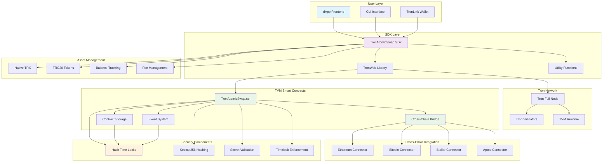
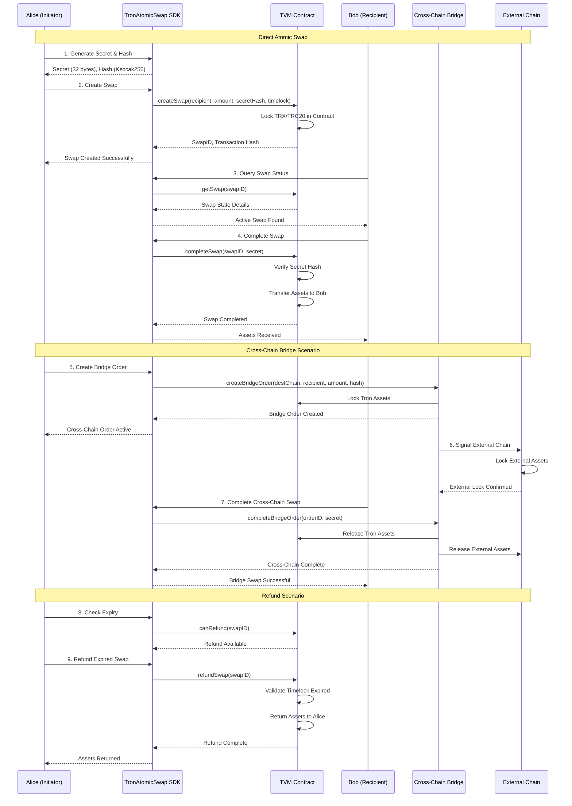

# 1inch Fusion+ Tron Integration

Production-ready atomic swap implementation for Tron blockchain using TVM (Tron Virtual Machine) smart contracts, enabling secure cross-chain swaps through Hash Time-Locked Contracts (HTLCs).

## 🚀 Features

- ✅ **Atomic Swaps**: Secure, trustless swaps using HTLCs on Tron
- ✅ **TVM Smart Contracts**: Native Tron smart contracts with optimal gas efficiency
- ✅ **Cross-Chain Bridge**: Coordinate swaps between Tron and 10+ other blockchains
- ✅ **TypeScript SDK**: Type-safe, easy-to-use developer interface
- ✅ **Production Contracts**: Gas-optimized Solidity contracts with comprehensive security
- ✅ **TRX & TRC20 Support**: Native TRX and TRC20 token support
- ✅ **Testing Suite**: Unit and integration tests with high coverage
- ✅ **Demo Examples**: Working examples for quick onboarding

## 📁 Project Structure

```
tron-integration/
├── contracts/                   # TVM smart contracts (Solidity)
│   ├── TronAtomicSwap.sol      # Core HTLC implementation
│   ├── interfaces/             # Contract interfaces
│   │   └── ITRC20.sol         # TRC20 token interface
│   └── libraries/              # Utility libraries
│       ├── SafeMath.sol       # Safe arithmetic operations
│       └── ReentrancyGuard.sol # Reentrancy protection
├── src/                        # TypeScript SDK
│   ├── TronAtomicSwap.ts      # Main SDK class
│   ├── examples/              # Demo implementations
│   └── tests/                 # Test suite
├── tronbox.js                 # Tron deployment configuration
├── package.json               # Node.js dependencies
└── README.md                 # This file
```

## 🏗️ Architecture

### System Architecture



### User Flow Diagram



## 🔧 Quick Start

### Installation

```bash
# Clone and navigate to project
cd tron-integration

# Install Node.js dependencies
npm install

# Build TypeScript SDK
npm run build

# Compile TVM contracts
npm run build:contracts
```

### Basic Usage

```typescript
import { TronAtomicSwap, TRON_NETWORKS, Utils } from '@1inch/fusion-plus-tron';

// Initialize SDK
const swapSDK = new TronAtomicSwap({
    network: TRON_NETWORKS.shasta, // Testnet
    contractAddress: 'TContract_Address_Here',
    privateKey: 'your_private_key_here',
});

// Generate atomic swap secret
const secret = TronAtomicSwap.generateSecret();
const secretHash = TronAtomicSwap.generateHashlock(secret);

// Create atomic swap with TRX
const swapResult = await swapSDK.createSwap({
    recipient: 'TRecipient_Address_Here',
    amount: '1000000', // 1 TRX (in SUN)
    tokenAddress: null, // null for TRX, contract address for TRC20
    secretHash,
    timelock: TronAtomicSwap.calculateTimelock(3600), // 1 hour
});

// Complete swap (Bob reveals secret to claim)
const completeResult = await swapSDK.completeSwap({
    swapId: swapResult.swapId,
    secret,
});
```

### TRC20 Token Swap

```typescript
// Create atomic swap with TRC20 token (USDT)
const usdtAddress = 'TR7NHqjeKQxGTCi8q8ZY4pL8otSzgjLj6t'; // USDT on Tron

const tokenSwapResult = await swapSDK.createSwap({
    recipient: 'TRecipient_Address_Here',
    amount: '1000000', // 1 USDT (6 decimals)
    tokenAddress: usdtAddress,
    secretHash,
    timelock: TronAtomicSwap.calculateTimelock(3600),
});
```

### Cross-Chain Bridge

```typescript
// Create outbound bridge order (Tron → Ethereum)
const bridgeResult = await swapSDK.createBridgeOrder({
    destinationChainId: 2, // Ethereum
    recipient: 'ethereum_address_here',
    amount: '10000000', // 10 TRX
    minDestinationAmount: '9500000', // Minimum expected
    tokenAddress: null, // TRX
    secretHash,
    timelock: TronAtomicSwap.calculateTimelock(7200), // 2 hours
});
```

## 🧪 Testing

```bash
# Run all tests
npm test

# Run TVM contract tests
npm run test:contracts

# Run with coverage
npm test -- --coverage

# Run integration tests (requires network)
npm run test:integration
```

## 🚀 Deployment

### Development (Shasta Testnet)

```bash
# Deploy to Tron Shasta testnet
npm run deploy:shasta
```

### Testing (Nile Testnet)

```bash
# Deploy to Tron Nile testnet
npm run deploy:nile
```

### Production (Mainnet)

```bash
# Deploy to Tron mainnet
npm run deploy:mainnet
```

## 📖 API Reference

### TronAtomicSwap Class

#### Constructor

```typescript
new TronAtomicSwap(config: TronAtomicSwapConfig)
```

#### Core Methods

| Method | Description | Returns |
|--------|-------------|---------|
| `generateSecret()` | Generate random secret for swap | `string` |
| `generateHashlock(secret)` | Create hash of secret | `string` |
| `createSwap(params)` | Create new atomic swap | `Promise<SwapResult>` |
| `completeSwap(params)` | Complete swap with secret | `Promise<CompleteResult>` |
| `refundSwap(swapId)` | Refund expired swap | `Promise<RefundResult>` |
| `getSwap(swapId)` | Get swap details | `Promise<SwapState>` |

#### Bridge Methods

| Method | Description | Returns |
|--------|-------------|---------|
| `createBridgeOrder(params)` | Create Tron → Other chain order | `Promise<BridgeResult>` |
| `completeBridgeOrder(...)` | Complete bridge order | `Promise<CompleteResult>` |
| `getBridgeOrder(orderId)` | Get bridge order details | `Promise<BridgeOrder>` |

#### Utility Methods

| Method | Description | Returns |
|--------|-------------|---------|
| `getBalance(tokenAddress?)` | Get account balance | `Promise<string>` |
| `createTestAccount()` | Create test account | `Promise<Account>` |
| `verifySecret(secret, hash)` | Verify secret against hash | `boolean` |

## 🔒 Security Features

### Smart Contract Security

- **Reentrancy Protection**: Guards against reentrancy attacks using ReentrancyGuard
- **Timelock Validation**: Enforces minimum/maximum timelock durations (1-24 hours)
- **Hash Verification**: Cryptographic secret validation using Keccak256
- **Authorization Checks**: Proper access control for all operations
- **Fee Management**: Protocol fee collection with configurable rates
- **Emergency Functions**: Admin-controlled emergency withdrawal capabilities

### SDK Security

- **Input Validation**: Comprehensive parameter validation
- **Type Safety**: Full TypeScript coverage prevents runtime errors
- **Network Validation**: Tron network configuration validation
- **Error Handling**: Graceful error handling and recovery
- **Private Key Management**: Secure key handling with TronWeb

## 🌐 Supported Chains

| Chain | Chain ID | Status |
|-------|----------|--------|
| Tron | 1 | ✅ Native |
| Ethereum | 2 | ✅ Active |
| Bitcoin | 3 | ✅ Active |
| Stellar | 4 | ✅ Active |
| Aptos | 5 | ✅ Active |
| Sui | 6 | ✅ Active |
| Polygon | 7 | ✅ Active |
| Arbitrum | 8 | ✅ Active |
| Optimism | 9 | ✅ Active |
| BSC | 10 | ✅ Active |

## 🪙 Supported Assets

### Native Assets
- **TRX**: Native Tron cryptocurrency

### TRC20 Tokens
- **USDT**: Tether USD (TR7NHqjeKQxGTCi8q8ZY4pL8otSzgjLj6t)
- **USDC**: USD Coin (TEkxiTehnzSmSe2XqrBj4w32RUN966rdz8)
- **BTT**: BitTorrent Token (TAFjULxiVgT4qWVjPHnEQ5s2LAYQAGwbxD)
- **WTRX**: Wrapped TRX (TNUC9Qb1rRpS5CbWLmNMxXBjyFoydXjWFR)
- **And many more TRC20 tokens**

## 🛠 Development

### Code Quality

```bash
# Lint TypeScript
npm run lint

# Fix linting issues
npm run lint:fix

# Format code
npm run format

# Clean build artifacts
npm run clean
```

### Environment Setup

Create a `.env` file:

```bash
# Testnet
SHASTA_PRIVATE_KEY=your_shasta_private_key
NILE_PRIVATE_KEY=your_nile_private_key

# Mainnet (be careful!)
MAINNET_PRIVATE_KEY=your_mainnet_private_key
```

### Contributing

1. Fork the repository
2. Create feature branch: `git checkout -b feature/new-feature`
3. Commit changes: `git commit -am 'Add new feature'`
4. Push to branch: `git push origin feature/new-feature`
5. Submit pull request

## ⚡ Performance & Gas Optimization

### Contract Optimizations
- **Storage Packing**: Efficient struct packing to minimize storage slots
- **Gas-Optimized Loops**: Minimized loop iterations in contract logic
- **Event Emission**: Comprehensive event logging for off-chain indexing
- **Batch Operations**: Support for batching multiple operations

### Network Efficiency
- **Bandwidth Optimization**: Minimized transaction data size
- **Energy Consumption**: Optimized for Tron's energy/bandwidth model
- **Smart Fee Management**: Dynamic fee calculation based on network conditions

## 📄 License

MIT License - see [LICENSE](../LICENSE) for details.

## 🔗 Links

- [1inch Fusion+ Documentation](https://docs.1inch.io/docs/fusion-plus/introduction)
- [Tron Documentation](https://developers.tron.network/)
- [TronWeb Documentation](https://tronweb.network/)
- [TVM Documentation](https://developers.tron.network/docs/tvm-introduction)
- [1inch Bounty Program](https://github.com/1inch/fusion-plus-bounty)

## 🆘 Support

- [GitHub Issues](https://github.com/1inch/fusion-plus/issues)
- [1inch Discord](https://discord.gg/1inch)
- [Developer Telegram](https://t.me/OneInchDevPortal)
- [Tron Developer Community](https://t.me/trondeveloper)

## 🏆 Acknowledgments

- **Tron Foundation**: For the innovative blockchain platform
- **1inch Network**: For Fusion+ protocol design
- **TronWeb Team**: For the excellent JavaScript library
- **Open Source Contributors**: For continuous improvements

---

**Built with ❤️ by the 1inch team for the Tron ecosystem** 